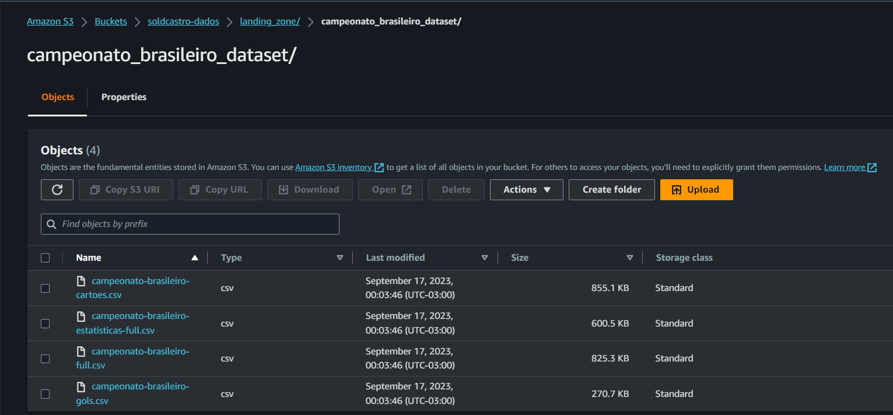
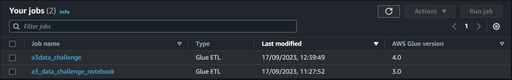
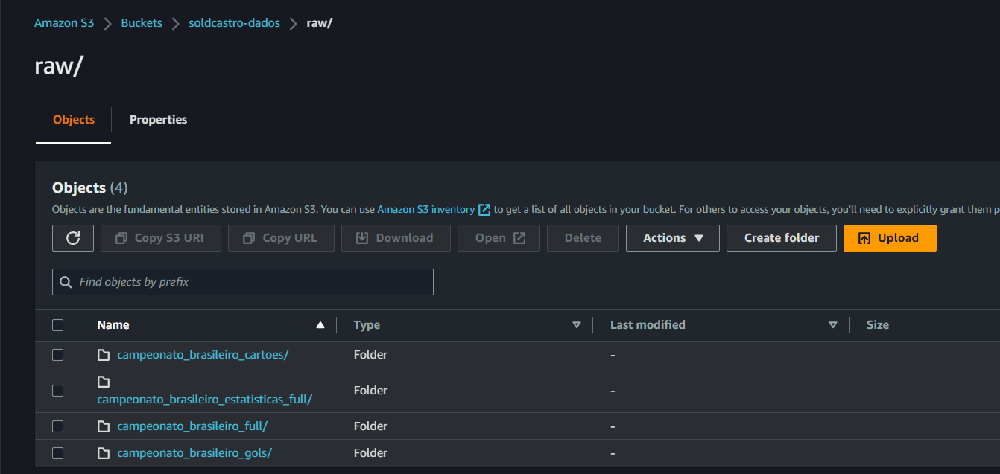
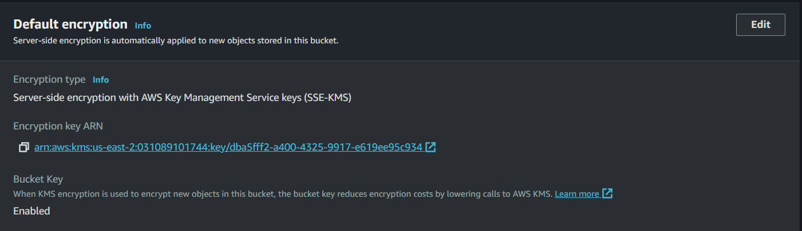
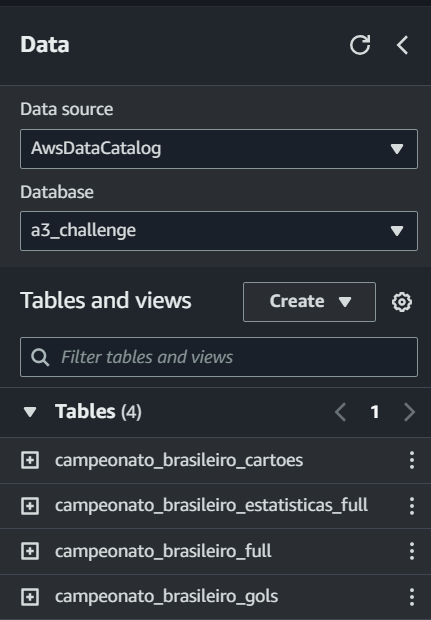
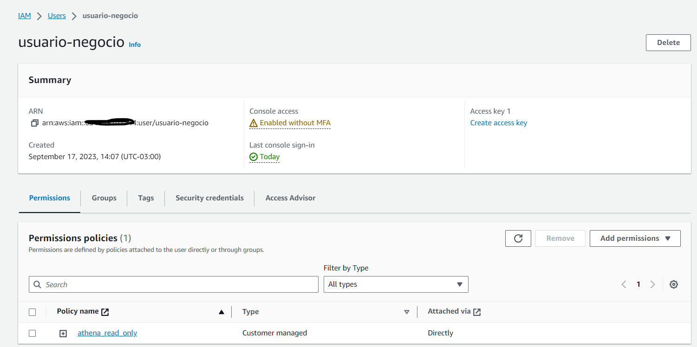
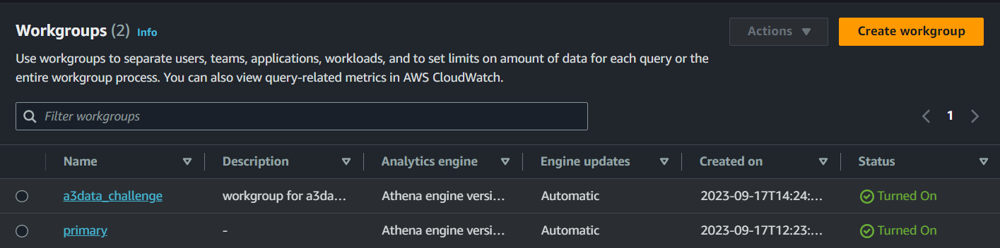

# a3data_challenge
Para este desafio foram escolhidos os serviços s3, glue e athena para armazenamento, processamento e visualização dos dados.
Os arquivos disponibilizados no repositório https://github.com/neylsoncrepalde/campeonato_brasileiro_dataset foram baixados e posteriormente colocados em um bucket s3 em uma pasta com nome "landing_zone".

Estes dados foram processados, escritos em parquet e disponibilizados em uma pasta de nome "raw" no mesmo bucket S3 usando o script "campeonato_process_glue_sparkframe.py" dentro de um job Glue.

Para encriptação padrão foi selecionada uma chave simetrica criada usando o serviço aws KMS conforme abaixo:

Tal escolha foi feita tendo em vista a segurança oferecida ao gravar e ler dados no bucket e também os custos pois foram configuradas "bucket keys" que de acordo com a AWS podem reduzir em 90% custos com requisições ao KMS.

Foram criadas tabelas no Athena para visualização dos dados em parquet salvos no S3. Para facilitar a criação foi usado o recurso de crawler do Glue que gerou as tabelas conforme os DDL presentes nos scripts ddl_*.sql presentes neste repositório.

Foi criado o usuário "usuario-negocio" e atachada a policy "athena_read_only". Nela o usuário tem apenas as permissões necessárias ler os dados referentes ao desafio que estão gravados na pasta "raw" mencionada anteriormente. Caso outros dados referentes a este desafio sejam incluídos, basta gravá-los na mesma pasta que o usuário poderá acessá-los através do Athena.
Para aumentar o controle foi criado também um workgroup no Athena chamado "a3data_challenge" que foi usado para aplicar as permissões.

As consultas solicitadas no desafio estão contidas nos scripts query_1.sql, query_2.sql e query_3.sql respectivamente.
